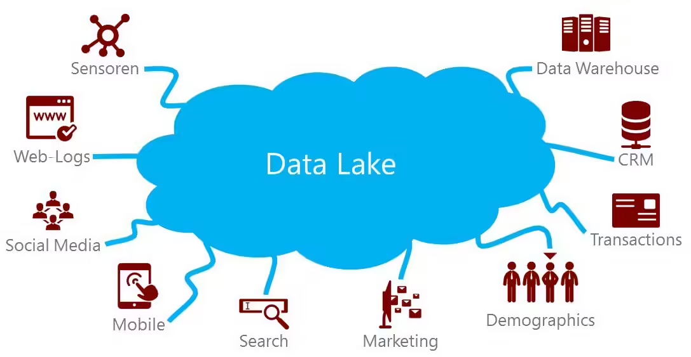
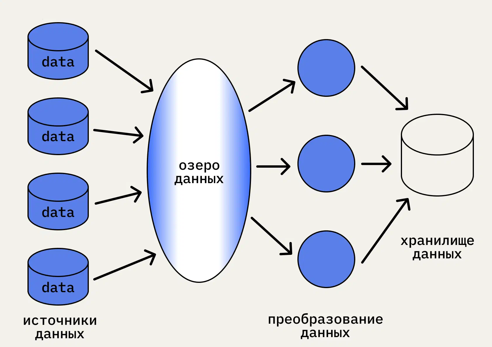
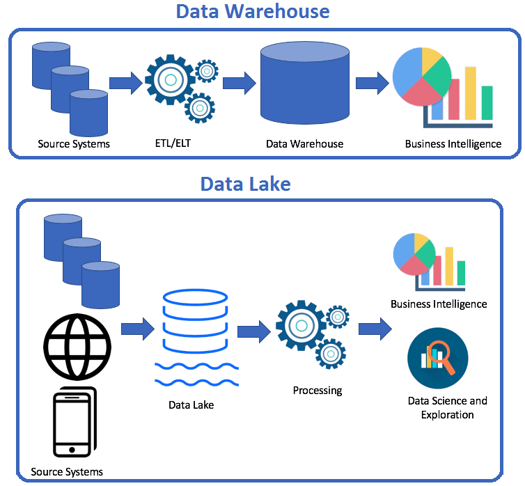

#  Что такое озеро данных?

Озеро данных (Data Lake) - это архитектурный подход к хранению и обработке больших объемов разнообразных данных в исходном формате, без предварительной обработки или структурирования.\
 Оно представляет собой централизованное хранилище данных, в которое собираются данные из различных источников, таких как транзакционные системы, социальные сети, датчики IoT, логи приложений и другие.

То есть не существует каких-либо готовых образов озер данных. Они всегда создаются с нуля и наполняются разнородными данными.

Основные характеристики озера данных:

1. Хранение в исходном формате: Данные в озере хранятся в исходном, непреобразованном виде, что позволяет сохранить их интегритет и предоставляет гибкость для последующей обработки и анализа.

2. Масштабируемость: Озеро данных способно хранить и обрабатывать огромные объемы данных, включая структурированные, неструктурированные и полуструктурированные данные.

3. Разнообразие данных: В озере данных могут храниться данные различных типов и форматов, такие как текстовые документы, изображения, аудио- и видеофайлы, JSON, XML, CSV, Parquet, Avro и многие другие.

4. Гибкий доступ и анализ: Озеро данных предоставляет гибкий доступ к данным и позволяет проводить анализ, исследования и выявление инсайтов с использованием различных инструментов и технологий.

5. Обработка в разном масштабе: Данные в озере могут быть обработаны как в реальном времени, так и в пакетном режиме, в зависимости от требований к конкретным задачам и приложениям.

6. Безопасность и управление данными: Важным аспектом озера данных является обеспечение безопасности данных и управление доступом к ним, включая контроль доступа, аудит, шифрование и управление версиями.

##  Сравнение озера данных с обычными базами данных

1. Хранение данных:
    + Обычные базы данных: Хранят данные в структурированном формате, обычно в виде таблиц с определенными схемами и типами данных.
    + Озеро данных: Хранит данные в неструктурированном или полуструктурированном формате, без необходимости предварительной обработки или установки схем.

2. Типы данных:
   + Обычные базы данных: Преимущественно используются для хранения структурированных данных, таких как данные транзакционных систем.
   + Озеро данных: Может хранить разнообразные типы данных, включая структурированные, неструктурированные и полуструктурированные данные.

3. Цель использования:
   + Обычные базы данных: Применяются для операционных задач, таких как хранение, обновление и запросы структурированных данных в реальном времени.
   + Озеро данных: Используется для аналитических целей, исследований данных, машинного обучения и хранения больших объемов данных из различных источников.

4. Обработка данных:
    + Обычные базы данных: Предназначены для обработки данных в реальном времени с использованием SQL-запросов и транзакционных операций.
    + Озеро данных: Предоставляет гибкость для обработки данных как в реальном времени, так и в пакетном режиме, с использованием различных инструментов и технологий.

5. Скорость доступа:
    + Обычные базы данных: Обеспечивают быстрый доступ к структурированным данным с использованием индексов и оптимизации запросов.
    + Озеро данных: Обеспечивает гибкий доступ к данным, но скорость доступа может быть медленнее из-за неструктурированности данных и необходимости их предварительной обработки перед анализом.

6. Управление данными:
   + Обычные базы данных: Обычно имеют жесткую структуру с определенными правилами целостности и схемами данных, что облегчает управление данными.
   + Озеро данных: Предоставляет большую гибкость, но требует более сложного управления данными из-за разнообразия форматов и источников данных.

## Актуальность озер данных

> Озера данных (Data Lakes) становятся все более актуальными в современном мире, где объемы данных растут с невероятной скоростью. \
В условиях цифровой трансформации бизнеса и стремительного развития технологий озера данных играют ключевую роль в управлении и анализе больших данных.
Почему озера данных актуальны:

1. Увеличение объемов данных:
    + С развитием Интернета вещей (IoT), социальных сетей, мобильных устройств и других источников данные генерируются в огромных объемах и с высокой скоростью. Традиционные хранилища данных не всегда справляются с такими объемами и разнообразием данных.

2. Разнообразие данных:
    + Современные предприятия работают с данными разных типов: структурированными (таблицы, базы данных), полуструктурированными (JSON, XML) и неструктурированными (тексты, изображения, видео). Озера данных позволяют хранить все эти данные в одном месте без предварительной обработки.

3. Гибкость и масштабируемость:
    + Озера данных легко масштабируются и могут адаптироваться к изменениям в объемах и типах данных. Это позволяет предприятиям быстро реагировать на новые требования и задачи.

4. Поддержка аналитики и машинного обучения:
    + Озера данных предоставляют богатые возможности для аналитики и машинного обучения. Доступ к разнообразным данным позволяет строить более точные модели и проводить глубокий анализ.

5. Экономическая эффективность:
    + Хранение данных в их исходном формате без необходимости предварительной обработки снижает затраты на хранение и обработку данных.

6. Реализация стратегии управления данными:
    + Озера данных играют важную роль в реализации стратегий управления данными, обеспечивая централизованное хранилище, откуда данные могут быть легко доступны для различных бизнес-процессов и аналитических задач.

## Преимущества озер данных

1. Гибкие варианты применения

Data Lake предоставляет возможность анализа данных без необходимости заранее определять способы их обработки. Данные из одного и того же хранилища можно использовать для различных целей: поиска совпадений и устранения дубликатов, подготовки данных для интеграции с внешними системами, проведения классификации, кластеризации или для задач машинного обучения.

2. Снижение эксплуатационных затрат

В отличие от традиционных аналитических хранилищ данных, которые использовались на протяжении последних 30 лет, Data Lake используют передовые открытые и бесплатные технологии, что значительно снижает расходы на сбор и обработку данных.

3. Ускоренный доступ к информации

Данные являются стратегическим активом, на основе которого можно создавать инновационные решения. Data Lake позволяет оперативно получать доступ к информации и принимать необходимые решения. Это особенно важно для искусственного интеллекта, который требует обработки больших объемов разнообразных данных.

4. Совместное использование данных

Крупные организации часто состоят из отдельных групп, каждая из которых работает с разными типами данных. Data Lake предоставляет объединенное хранилище, что способствует налаживанию эффективного сотрудничества между командами, предоставляя общий доступ к данным.

5. Бесконечная масштабируемость

Data Lake обеспечивают возможность масштабирования практически без ограничений, благодаря низкой стоимости хранения данных. Они поддерживают как горизонтальное, так и вертикальное масштабирование, позволяя обрабатывать данные объемом вплоть до нескольких петабайт.

## Болото данных

`Болото данных` — это термин, используемый для описания озера данных, которое вышло из-под контроля.\
 В болотах данных хранится множество данных, которые становятся неуправляемыми, неорганизованными и трудно доступными. Это может привести к низкому качеству данных и невозможности их эффективного использования.

`Причины возникновения болота данных:`

1. Отсутствие управления данными: Если данные поступают в озеро данных без четкой структуры и правил управления, они быстро становятся неуправляемыми.

2. Недостаток метаданных: Без метаданных (данных о данных) становится трудно найти и понять, какие данные хранятся в озере, что приводит к хаосу и неразберихе.

3. Плохая организация данных: Если данные не организованы должным образом и не имеют системы классификации, они становятся трудно доступны и бесполезны.

4. Отсутствие контроля качества данных: Если данные не проходят проверку на качество и не очищаются, они могут содержать ошибки, дубликаты и устаревшую информацию.

`Последствия болота данных:`

1. Трудности в поиске данных: Пользователи не могут найти нужные данные из-за отсутствия структуры и метаданных.

2. Низкое качество данных: Ошибки, дубликаты и устаревшие данные затрудняют проведение точного анализа.

3. Повышенные затраты: Временные и финансовые затраты на управление данными увеличиваются из-за необходимости их очистки и реструктуризации.

4. Снижение эффективности анализа: Низкое качество данных приводит к ошибкам в анализе и принятию неверных решений.

`Как избежать болота данных:`

1. Стратегия управления данными: Разработайте и внедрите четкую стратегию управления данными, включая правила для загрузки, хранения и обработки данных.

2. Метаданные и каталогизация: Обеспечьте, чтобы все данные имели соответствующие метаданные и были каталогизированы. Это поможет пользователям находить и понимать данные.

3. Качество данных: Внедрите процедуры проверки качества данных, такие как очистка, нормализация и удаление дубликатов.

4. Управление доступом и безопасностью: Определите, кто имеет доступ к данным, и обеспечьте безопасность данных с помощью ролей и разрешений.

5. Мониторинг и аудит: Регулярно мониторьте и проводите аудит данных и процессов управления данными, чтобы выявлять и устранять проблемы на ранних стадиях.

6. Обучение пользователей: Обучите пользователей, как правильно загружать, хранить и использовать данные. Это поможет снизить риск возникновения болота данных.

## Архитектура озер данных

`Архитектура Data Lake (озера данных) `организована таким образом, чтобы эффективно собирать, хранить, обрабатывать и анализировать большие объемы данных из различных источников. \
Она состоит из нескольких ключевых компонентов и слоев, которые обеспечивают интеграцию данных, управление метаданными, безопасность и доступность данных для аналитики.
Основные компоненты и слои архитектуры Data Lake

1. Источники данных (Data Sources)
2. Хранилище данных (Data Storage)
3. Слой обработки данных (Data Processing Layer)
4. Слой управления метаданными (Metadata Management Layer)
5. Слой безопасности и управления (Security and Governance Layer)
6. Слой аналитики и потребления данных (Analytics and Consumption Layer)

1. Источники данных (Data Sources)

* Структурированные данные: базы данных (SQL), CRM, ERP.
* Полуструктурированные данные: журналы (лог-файлы), JSON, XML, CSV.
* Неструктурированные данные: документы, изображения, видео, аудио.
* Стриминг данных: данные от IoT-устройств, сенсоров, и потоковые данные.

Примеры:

+ Транзакционные системы: данные о продажах, заказы, учетные записи.
+ Файловые системы: данные из файловых систем и облачных хранилищ.
+ API и веб-сервисы: данные от внешних API и веб-сервисов.

2. Хранилище данных (Data Storage)

Основное хранилище для всех типов данных в их естественном формате. Включает в себя:

+ Raw Zone (Сырая зона): хранение необработанных данных в исходном виде.
+ Processed Zone (Обработанная зона): хранение данных после первоначальной очистки и трансформации.
+ Curated Zone (Кураторская зона): хранение данных, подготовленных для анализа.
+ Consumption Zone (Зона потребления): хранение данных, специально подготовленных для использования аналитиками.

Примеры технологий:

+ Облачные хранилища: Amazon S3, Azure Data Lake Storage, Google Cloud Storage.
+ Локальные распределенные файловые системы: Hadoop HDFS.

3. Слой обработки данных (Data Processing Layer)

Обеспечивает очистку, трансформацию и анализ данных.

+ ETL/ELT инструменты: извлечение, трансформация, и загрузка данных.
+ Инструменты потоковой обработки: обработка данных в реальном времени.
+ Аналитические и вычислительные движки: SQL-запросы, обработка больших данных.

Примеры технологий:

+ ETL/ELT: Apache Nifi, Talend, AWS Glue.
+ Обработка данных: Apache Spark, Apache Flink, Presto.

4. Слой управления метаданными (Metadata Management Layer)

Управление и каталогизация данных для упрощения их поиска и использования.

+ Каталог данных: хранение и управление схемами данных, дескрипторами и линиями данных.
+ Системы управления метаданными: обеспечение доступа к информации о данных и их контексте.

Примеры технологий:

+ Apache Atlas: управление метаданными и их каталогизация.
+ AWS Glue Data Catalog: управление метаданными в AWS.

5. Слой безопасности и управления (Security and Governance Layer)

Обеспечивает защиту данных и их соответствие нормативным требованиям.

+ Управление доступом: контроль доступа к данным на основе ролей и политик.
+ Шифрование данных: защита данных при хранении и передаче.
+ Аудит и мониторинг: отслеживание использования данных и доступ к ним.

Примеры технологий:

+ Управление доступом: AWS IAM, Azure RBAC.
+ Шифрование: AWS KMS, Azure Key Vault.
+ Аудит: CloudTrail, Azure Monitor.

6. Слой аналитики и потребления данных (Analytics and Consumption Layer)

Инструменты и интерфейсы для анализа данных и создания отчетов.

+ Аналитические платформы: проведение аналитики и выполнение SQL-запросов.
+ Инструменты BI и визуализации: построение дашбордов и отчетов.
+ API и интерфейсы данных: предоставление данных для приложений и сервисов.

Примеры технологий:

+ SQL-запросы: Amazon Athena, Azure Synapse Analytics.
+ BI-инструменты: Tableau, Power BI.
+ Интерфейсы данных: API для приложений и сервисов.

### Порядок обработки и маршрутизации данных

1. Сбор данных: Данные поступают из различных источников и загружаются в сырую зону Data Lake.
2. Очистка и трансформация: Данные очищаются и трансформируются для дальнейшего использования. Хранятся в обработанной зоне.
3. Кураторство данных: Данные готовятся и организуются для анализа. Хранятся в кураторской зоне.
4. Анализ и потребление: Данные используются для аналитики и отчетности, предоставляются пользователям и аналитическим инструментам.

 