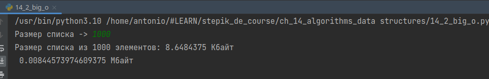
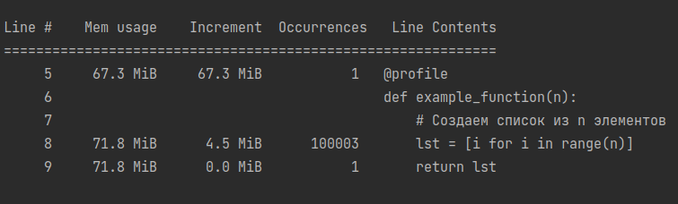
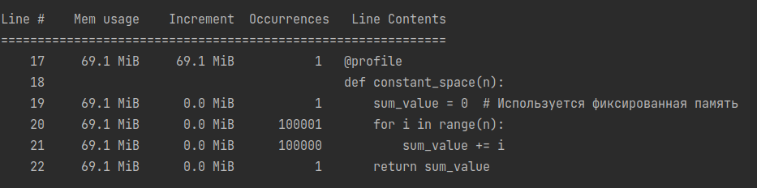
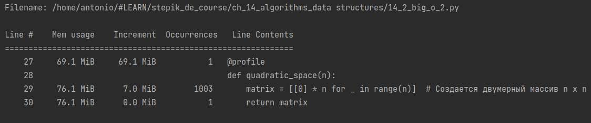

Для начала, ответим на вопрос, что такое оценка алгоритма? Оценка алгоритма — это способ измерить его эффективность с точки зрения использования ресурсов, таких как время и память. Эти оценки позволяют понять, как алгоритм будет вести себя с увеличением размера входных данных и как он подходит для решения задачи.

Зачем нам оценивать алгоритм? Все просто. Потому что чаще всего алгоритм используют в разных задачах и на разных ресурсах. Везде должны быть оптимальные метрики.

Существует два основных типа оценки алгоритмов.

    Временная оценка:
        Оценивает, сколько времени потребуется для выполнения алгоритма в зависимости от размера входных данных.
        Выражается количеством операций, выполняемых алгоритмом, или количеством шагов, которые он должен выполнить.

    Пространственная оценка:
        Оценивает, сколько памяти потребует алгоритм для выполнения.
        Это важно для понимания, насколько эффективно алгоритм использует память и подходит ли он для устройств с ограниченными ресурсами.

Теперь обо всем поподробнее. Рассмотрим основные аспекты временной оценки - 

    Обычно оценивается в терминах "асимптотической сложности", которая показывает поведение алгоритма при увеличении объема входных данных.
    Самый худший случай (Worst-case complexity) — это максимум времени, который может понадобиться алгоритму для завершения работы при самых неблагоприятных входных данных.
    Лучший случай (Best-case complexity) — минимальное время выполнения для самых благоприятных данных.
    Средний случай (Average-case complexity) — среднее время выполнения для всех возможных данных.

Окей, появились какие-то метрики, относящиеся к временной оценке, но как измерять? Сантиметрами, секундами, кубометрами?

Для описания временной сложности часто используется нотация "О-большое" (Big O notation), которая показывает, как временная сложность алгоритма растет по мере увеличения входного размера.


    O(1) — Константная сложность: время выполнения не зависит от размера входных данных. Пример: доступ к элементу массива по индексу.

    O(log n) — Логарифмическая сложность: время выполнения растет логарифмически с увеличением входных данных. Пример: бинарный поиск.

    O(n) — Линейная сложность: время выполнения увеличивается линейно по мере увеличения входных данных. Пример: простой поиск элемента в списке.

    O(n^2) — Квадратичная сложность: время выполнения увеличивается пропорционально квадрату размера входных данных. Пример: сортировка вставками или пузырьковая сортировка.

    O(2^n) — Экспоненциальная сложность: время выполнения растет экспоненциально и очень быстро становится непрактичным при увеличении размера входных данных. Пример: алгоритмы перебора для решения комбинаторных задач.

Рассмотрим сразу же пример, алгоритм линейного поиска, который ищет элемент в массиве.

Также сделаем реализацию - 
```python
def linear_search(arr, target):
    for index, element in enumerate(arr):
        if element == target:
            return index  # Возвращаем индекс, если элемент найден
    return -1  # Возвращаем -1, если элемент не найден

Лучший случай (O(1)): В лучшем случае элемент, который мы ищем, находится на первом месте в массиве. Тогда алгоритм выполнит поиск за одну операцию.

То есть например, как здесь.
```python
arr = [10, 20, 30, 40, 50]
target = 10  # Элемент находится на первом месте
result = linear_search(arr, target)
print(f"Индекс найденного элемента: {result}")
# Output: Индекс найденного элемента: 0
```
Худший случай (O(n)): В худшем случае элемент либо отсутствует в массиве, либо находится на последнем месте. В таком случае алгоритму придется пройти весь массив.
```python
arr = [10, 20, 30, 40, 50]
target = 60  # Элемент отсутствует в массиве
result = linear_search(arr, target)
print(f"Индекс найденного элемента: {result}")
# Output: Индекс найденного элемента: -1
```
```python
# Или:
target = 50  # Элемент на последнем месте
result = linear_search(arr, target)
print(f"Индекс найденного элемента: {result}")
# Output: Индекс найденного элемента: 4
```

### Пространственная оценка
Не забываем также и про пространственную оценку. Напоминаю, что она показывает, сколько памяти требуется для выполнения алгоритма.

Пространственная оценка состоит из двух основных частей.

    Постоянная память: Это память, которая не зависит от размера входных данных. Она включает в себя:
        Константы, которые определены в алгоритме.
        Память, используемую для хранения значений функций и переменных, которые не меняются.

    Переменная память: Это память, которая изменяется в зависимости от размера входных данных. Сюда входят:
        Память, используемая для хранения входных данных.
        Вспомогательные структуры данных, такие как массивы или списки, которые изменяются с ростом входных данных.
        Рекурсивные вызовы, которые могут создавать новые уровни стека при каждом вызове функции.

Также, как и во временной оценке, мы используем O-большое, оно же биг О, или же Big O. Только здесь немного другие описания, хотя смысл остается таким же.

    O(1) — Константная память: Алгоритм использует фиксированное количество памяти, независимо от размера входных данных.
    O(n) — Линейная память: Память растет линейно в зависимости от размера входных данных.
    O(n^2) — Квадратичная память: Память растет пропорционально квадрату размера входных данных.

Давайте рассмотрим пример использованиая функции из модуля sys.getsizeof.
```python
import sys

def example_list(n):
    # Создаем список из n элементов
    lst = [i for i in range(n)]
    return lst

# Размер списка из 1000 элементов
n = 1000
lst = example_list(n)
print(f"Размер списка из {n} элементов: {sys.getsizeof(lst)} байт")
```
Вывод будет следующим.



Как Вы думаете, какая пространственная сложность этой функции? Давайте разберемся.

    Пространственная сложность зависит от размера списка lst, который мы создаем в функции. Для каждого элемента i в диапазоне от 0 до n−1 создается элемент списка, поэтому общий объем памяти растет пропорционально n.
    В Python список занимает больше памяти, чем просто данные, так как он хранит метаинформацию и резервирует дополнительную память для повышения производительности. Однако основная часть памяти все же выделяется пропорционально количеству элементов в списке.

Таким образом, пространственная сложность этого кода будет O(n), так как память, которую занимает список, линейно зависит от числа элементов n.

Когда мы говорим, про пространственную оценку, нельзя не упомянуть об инструменте memory-profiler, ведь он позволяет профилировать использование памяти при выполнении функции. Установка происходит за счет следующей команды в терминале - 

pip install memory-profiler

 Далее возьмем следующий код для примера.

from memory_profiler import profile
```python
@profile
def example_function(n):
    # Создаем список из n элементов
    lst = [i for i in range(n)]
    return lst

example_function(100000)
```
И посмотрим, что получиться.



    Line #: Номер строки в файле кода.
    Mem usage: Текущая общая используемая память в мегабайтах (MiB) после выполнения этой строки.
    Increment: Прирост памяти после выполнения этой строки (разница в памяти между текущей и предыдущей строкой).
    Occurrences: Количество раз, когда строка выполнялась.
    Line Contents: Код, который был выполнен.

Эти данные показывают, что функция example_function с размером n = 100000 требует около 3.7 MiB дополнительной памяти для хранения списка из 100,000 элементов. 

Окей. Но, давайте также рассмотрим и константную пространственную сложность (O(1)), которая нами также была наверху упомянута.
```python
def constant_space(n):
    sum_value = 0  # Используется фиксированная память
    for i in range(n):
        sum_value += i
    return sum_value
```
Эта функция использует константное количество памяти, поскольку переменная sum_value и счетчик i не зависят от размера входных данных n.



А также рассмотрим квадратичную пространственную сложность.
```python
def quadratic_space(n):
    matrix = [[0] * n for _ in range(n)]  # Создается двумерный массив n x n
    return matrix
```
Функция создает квадратную матрицу, размер которой зависит от квадрата n.

