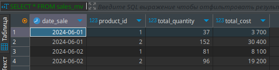

# Движки в ClickHouse

Движок таблицы (тип таблицы) определяет:

> Где и как хранятся данные: Движок определяет, как данные сохраняются на диске, какие файлы используются, и как они организованы.

> Какие запросы поддерживаются и как: Разные движки могут обрабатывать запросы по-разному. Например, некоторые движки могут быстро выполнять агрегацию данных, а другие — быстро вставлять новые записи.

> Конкурентный доступ к данным: Движок определяет, как обеспечивается доступ к данным при одновременных запросах от нескольких пользователей.

> Использование индексов: Некоторые движки поддерживают индексы для ускорения поиска данных.

> Многопоточное выполнение запросов: Некоторые движки могут обрабатывать несколько запросов одновременно.

> Параметры репликации данных: Если вы используете репликацию данных, то движок определяет, как данные реплицируются между узлами.
>

Мы рассмотрим следующие движки ClickHouse и разберемся в их предназначении и особенностях:

- MergeTree\
- SummingMergeTree\
- AggregatingMergeTree\
- ReplacingMergeTree\
- CollapsingMergeTree\
- VersionedCollapsingMergeTree

## Движок MergeTree

Движок MergeTree, а также другие движки этого семейства — это наиболее функциональные движки таблиц ClickHouse.

Основная идея, заложенная в основу движков семейства MergeTree следующая:  Когда у вас есть огромное количество данных, которые должны быть вставлены в таблицу, вы должны быстро записать их по частям, а затем объединить части по некоторым правилам в фоновом режиме. Этот метод намного эффективнее, чем постоянная перезапись данных в хранилище при вставке.

Базовый механизм таблиц MergeTree можно считать механизмом таблиц по умолчанию для экземпляров ClickHouse с одним узлом, поскольку он универсален и практичен для широкого спектра случаев использования. Все движки семейства MergeTree добавляют дополнительную функциональность для некоторых конкретных случаев использования. Обычно это реализуется как дополнительная манипуляция данными в фоновом режиме. Основным недостатком движков MergeTree является то, что они довольно тяжелые.

+ Хранит данные, отсортированные по первичному ключу. Это позволяет создавать разреженный индекс небольшого объёма, который позволяет быстрее находить данные.

+ Позволяет оперировать партициями, если задан ключ партиционирования. ClickHouse поддерживает отдельные операции с партициями, которые работают эффективнее, чем общие операции с этим же результатом над этими же данными. Также, ClickHouse автоматически отсекает данные по партициям там, где ключ партиционирования указан в запросе. Это также увеличивает эффективность выполнения запросов.

**MergeTree** - базовый движок ClickHouse, используемый для хранения данных с эффективной индексацией и сжатием.
Основные особенности:

> Индексация по указанным ключам: позволяет быстро находить строки.
Асинхронное слияние данных: улучшает производительность при вставке данных.
Сжатие данных: уменьшает объем хранения.

```SQL

CREATE TABLE default.sales_merge_tree
(
    date Date,
    product String,
    quantity UInt32,
    price Float32,
    order_id UInt32
) ENGINE = MergeTree
ORDER BY date;

INSERT INTO default.sales_merge_tree (date, product, quantity, price, order_id) VALUES
('2023-05-01', 'Widget A', 10, 5.0, 1),
('2023-05-01', 'Widget A', 15, 4.5, 2),
('2023-05-02', 'Gadget B', 20, 10.0, 3);

```


> Для каждого запроса INSERT ClickHouse создает отдельную папку внутри себя (поэтому кстати и нужно вставлять редко и "по много"). 

> В каждой из этих папок происходит упорядочивание данных по указанному ключу сортировки - сортирование по сути, а потом "в фоне" ClickHouse начинает все это оптимизировать своими алгоритмами, поэтому движок и называется MergeTree - дерево слияния: множество сортированных данных, по сортированным папкам сливаются единую базу по некоторым правилам.


## SummingMergeTree

**SummingMergeTree** - это разновидность MergeTree, которая автоматически суммирует данные по определённым столбцам при слиянии строк. Полезно для хранения и агрегирования данных, например, финансовых транзакций.

Основные особенности:

+ Автоматическое суммирование: складывает значения в указанных столбцах.
Полезен для финансовых данных: например, для хранения и суммирования транзакций.

+ Указывается движок при создании таблицы следующим образом:

```ENGINE = SummingMergeTree([columns])```

+ [columns] -кортеж с именами столбцов, в которых будут суммироваться данные. ОБЯЗАТЕЛЬНО ЧИСЛОВЫЕ! Если `columns` не задан, то ClickHouse суммирует значения во всех столбцах с числовым типом данных, не входящих в первичный ключ (ключ сортировки из ORDER BY)

```SQL
CREATE TABLE IF NOT EXISTS `default`.sales_summing_merge_tree
(
date DATE,
product String,
quantity UInt32,
) ENGINE = SummingMergeTree
ORDER BY `date`;

--Вставим данные о продажах 2х условных товаров/услуг:

INSERT INTO sales_summing_merge_tree (date, product, quantity) VALUES
('2023-05-01', 'Widget A', 10),
('2023-05-02', 'Gadget B', 20),
('2023-05-01', 'Widget A', 11),
('2023-05-02', 'Gadget B', 22),
('2023-05-01', 'Widget A', 12),
('2023-05-02', 'Gadget B', 23);

SELECT *
FROM sales_summing_merge_tree

```


> Добавим еще данных, за другие дни:

```sql
INSERT INTO sales_summing_merge_tree (date, product, quantity) VALUES
('2023-05-02', 'Widget A', 100),
('2023-05-01', 'Gadget B', 200),
('2023-05-02', 'Widget A', 110),
('2023-05-01', 'Gadget B', 220),
('2023-05-02', 'Widget A', 120),
('2023-05-01', 'Gadget B', 230);

SELECT *
FROM sales_summing_merge_tree;
```


## AggregatingMergeTree

**AggregatingMergeTree** - схож с SummingMergeTree, но поддерживает более сложные агрегации, такие как среднее, максимум, минимум и другие. Это позволяет выполнять агрегацию на уровне хранения данных, что ускоряет выполнение запросов с агрегацией.

Основные особенности:

+ Поддержка сложных агрегационных функций: таких как sum, avg, max, min и другие.
Полезен для аналитических задач: позволяет выполнять агрегации на уровне хранения данных.

+ Этот движок совместно с материализованным представлением (Мaterialized view) хорошо подходит и активно используется для создания витрин данных.

Cоздадим материализованное представление  которое будет "смотреть" за вставками данных в основную таблицу. 

При вставке данных в основную таблицу, запрос SELECT указанный при создании представлении преобразовывает данные и вставляет их в представление.

Cоздадим простую таблицу, которая будет хранить сырые данные о продажах. Также создадим материализованное представление, которое будет следить за вставками данных в таблицу продаж и сохранять нужную нам статистику в отдельную таблицу.

```sql

CREATE TABLE IF NOT EXISTS `default`.sales_raw -- таблица продаж
(
date_sale Date, 	-- Дата продажи
product_id UInt32,  -- Идентификатор продукта (будет 1 и 2)
quantity UInt32,    -- Количество проданных единиц
price Float32		--Цена за единицу товара 
) ENGINE = MergeTree()
ORDER BY date_sale;


-- создаем материализованное представление, которое будет суммировать количество проданных товаров и общую сумму продаж


CREATE MATERIALIZED VIEW IF NOT EXISTS sales_mv
ENGINE = AggregatingMergeTree()
ORDER BY (date_sale, product_id) 
AS
SELECT date_sale
	   ,product_id
	   ,SUM(quantity) AS total_quantity     -- Суммарное количество (агрегация по датам и id продукта)
	   ,SUM(quantity * price) AS total_cost -- Суммарная стоимость проданных товаров (количество * цену)
FROM `default`.sales_raw
GROUP BY date_sale , product_id 

-- Материализованное представление, как можно заметить, создает себе вспомогательную таблицу, из которой и берет данные.

```


```sql
INSERT INTO sales_raw 
VALUES 
    ('2024-06-01', 1, 10, 100.0),
    ('2024-06-01', 1, 7, 100.0),
    ('2024-06-01', 2, 25, 200.0),
    ('2024-06-01', 2, 3, 200.0),
    ('2024-06-01', 2, 8, 200.0),
    ('2024-06-01', 1, 6, 100.0),
    ('2024-06-01', 2, 2, 200.0),
    ('2024-06-01', 2, 12, 200.0),
    ('2024-06-01', 2, 21, 200.0),
    ('2024-06-01', 1, 7, 100.0),
    ('2024-06-01', 2, 20, 200.0),
    ('2024-06-01', 2, 33, 200.0),
    ('2024-06-01', 2, 28, 200.0),
    ('2024-06-01', 1, 7, 100.0);


SELECT *
FROM sales_mv

-- вставим вторую "порцию" данных, уже за следующий день.

INSERT INTO sales_raw 
VALUES 
    ('2024-06-02', 1, 3, 100.0),
    ('2024-06-02', 1, 22, 100.0),
    ('2024-06-02', 2, 5, 200.0),
    ('2024-06-02', 2, 43, 200.0),
    ('2024-06-02', 2, 2, 200.0),
    ('2024-06-02', 1, 4, 100.0),
    ('2024-06-02', 2, 26, 200.0),
    ('2024-06-02', 2, 2, 200.0),
    ('2024-06-02', 2, 1, 200.0),
    ('2024-06-02', 1, 37, 100.0),
    ('2024-06-02', 2, 2, 200.0),
    ('2024-06-02', 2, 12, 200.0),
    ('2024-06-02', 2, 3, 200.0),
    ('2024-06-02', 1, 15, 100.0);

SELECT *
FROM sales_mv

```



## ReplacingMergeTree

**ReplacingMergeTree** - движок, позволяющий заменять старые версии строк новыми при слиянии. Это полезно для хранения актуальных данных без дубликатов.

Основные особенности:

+ Замена строк: строки с одинаковыми ключами сортировки, указанными в секции ORDER BY , заменяются новыми значениями.
+ Полезен для обновления данных: например, при хранении информации о пользователях.

```sql
CREATE TABLE default.replacing_MT
(
    key Int64,
    event_name String,
    eventTime DateTime
)
ENGINE = ReplacingMergeTree
ORDER BY key;


INSERT INTO replacing_MT Values (1, 'первая вставка', '2024-03-03 03:03:03');
INSERT INTO replacing_MT Values (1, 'вторая вставка', '2023-01-01 00:00:00');
INSERT INTO replacing_MT Values (1, 'третья вставка', '2022-01-01 00:00:00');


```


Мы используем несколько запросов INSERT для создания различных кусков данных. Если мы вставляем данные с помощью одного запроса, ClickHouse создаёт один кусок данных и не будет выполнять слияние

А для того чтобы сделать слияние данных принудительно, то есть увидеть сразу как работает движок, мы добавляем к запросу модификатор FINAL. ВАЖНО! Это очень неэффективный способ выбора данных. Не используйте его для больших таблиц. Нормальный режим работы любого движка - в фоне.


Теперь рассмотрим еще один пример с точно такой же таблицей, но добавим в параметры движка **eventTime**:

```sql
CREATE TABLE default.replacing_MT_with_param
(
    key Int64,
    event_name String,
    eventTime DateTime
)
ENGINE = ReplacingMergeTree (eventTime)
ORDER BY key;


INSERT INTO replacing_MT_with_param Values (1, 'первая вставка', '2024-03-03 03:03:03');
INSERT INTO replacing_MT_with_param Values (1, 'вторая вставка', '2023-01-01 00:00:00');
INSERT INTO replacing_MT_with_param Values (1, 'третья вставка', '2022-01-01 00:00:00');
```


Результат опять одна строка, но теперь та, которая самая "свежая" по времени(используется параметр eventTime)


## CollapsingMergeTree

**CollapsingMergeTree** - движок, позволяющий "сворачивать" старые версии строк, помечая их как удалённые, но не удаляя физически.

Основные особенности:

+ Сворачивание строк: строки могут помечаться как удалённые при слиянии.
+ Полезен для мягкого удаления данных: где строки помечаются как удалённые, но не удаляются физически.

Создадим таблицу чтобы наглядно увидеть, как это работает:

CREATE TABLE default.sales_collapsing_merge_tree
(
    date Date,
    product String,
    quantity UInt32,
    price Float32,
    order_id UInt32,
    sign Int8
) ENGINE = CollapsingMergeTree(sign)
ORDER BY date;

Вставим данные двумя вставками:

```sql
INSERT INTO sales_collapsing_merge_tree (date, product, quantity, price, order_id, sign) VALUES
('2023-05-01', 'Widget A', 10, 5.0, 1, 1),
('2023-05-02', 'Gadget B', 20, 10.0, 3, 1);

-- И еще раз:

INSERT INTO sales_collapsing_merge_tree (date, product, quantity, price, order_id, sign) VALUES
('2023-05-01', 'Widget A', 10, 5.0, 1, -1),
('2023-05-01', 'Widget A', 15, 4.5, 2, 1);
```
В данном примере используем два запроса INSERT для создания двух различных кусков данных.  Напоминаю причины такого решения: если мы вставляем данные с помощью одного запроса, ClickHouse создаёт один кусок данных и не будет выполнять слияние. Наш пример не совсем корректен, потому как слишком маленький - в реальности это были бы две больших вставки данных и обработка( слияние движком) их занимала бы некоторое время. 

ClickHouse объединяет части данных в неизвестный момент времени, который мы не можем предсказать -  и это одна из особенностей, которую нужно учитывать работая с большими объемами. Но мы пока ограничимся нашей "песочницей" которая, несмотря на размеры, позволит увидеть "магию" работы  и этого движка ClickHouse.

Опять сделаем слияние данных принудительно, чтобы увидеть сразу как работает движок, для этого снова добавим к запросу модификатор FINAL. Напоминаю! Это очень неэффективный способ выбора данных. Не используйте его для больших таблиц.

Выполним вывод всех строк из таблицы: 

```sql
SELECT * FROM sales_collapsing_merge_tree FINAL
```

Можно увидеть, что в результате мы получим не 4 строки, а 2:


Это произошло, потому что в данных было 2 одинаковых строки, отличающиеся значением столбика sign. Движок "схлопнул" данные с противоположными значениями sign. 

Эта особенность еще используется для удаления строк и корректировки вставленных ранее данных - замена UPDATE с учетом специфики работы ClickHouse.


## VersionedCollapsingMergeTree

**VersionedCollapsingMergeTree** - усовершенствованная версия CollapsingMergeTree, добавляющая поддержку версий строк. Это позволяет более точно управлять жизненным циклом данных.

VersionedCollapsingMergeTree предназначен для тех же задач, что и CollapsingMergeTree, но использует другой алгоритм свёртывания, который позволяет вставлять данные в любом порядке в несколько потоков. В частности, столбец Version помогает свернуть строки правильно, даже если они вставлены в неправильном порядке. CollapsingMergeTree требует строго последовательную вставку данных.

Основные особенности:

+ Поддержка версий: строки могут заменяться более новыми версиями.
+ Сворачивание с версиями: старые версии строк помечаются как удалённые и заменяются новыми.

Традиционный пример с уже знакомой нам таблицей, но с движком VersionedCollapsingMergeTree и добавленным столбцом Version:

Традиционный пример с уже знакомой нам таблицей, но с движком VersionedCollapsingMergeTree и добавленным столбцом Version:

```sql

CREATE TABLE default.sales_versioned_collapsing_merge_tree
(
    date Date,
    product String,
    quantity UInt32,
    price Float32,
    order_id UInt32,
    sign Int8,
    version Int8
) ENGINE = VersionedCollapsingMergeTree(sign,version)
ORDER BY date;

-- Добавим данные опять двумя вставками:

INSERT INTO sales_versioned_collapsing_merge_tree (date, product, quantity, price, order_id, sign, version) VALUES
('2023-05-01', 'Widget A', 10, 5.0, 1, 1, 1);

-- и

INSERT INTO sales_versioned_collapsing_merge_tree (date, product, quantity, price, order_id, sign, version) VALUES
('2023-05-01', 'Widget A', 10, 5.0, 1, -1, 1),
('2023-05-01', 'Widget A', 15, 4.5, 2, 1, 2);

```
Мы опять используем два запроса INSERT для создания двух различных кусков данных.

Выполняем наш запрос на получение всех строк (ЕЩЕ РАЗ! Не используйте FINAL для больших таблиц) :

```sql
SELECT * FROM sales_versioned_collapsing_merge_tree FINAL;
```

Получаем, как и ожидалось одну - со значением столбца version равным 2. Строки с одинаковыми ключами сортировки и с противоположными sign -  ожидаемо "схлопнулись".


## Плюсы и минусы ClickHouse

Плюсы использования ClickHouse мы перечисляли во всех предыдущих главах. Вкратце - это ошеломляющая скорость получения данных и все вытекающие из этого плюсы по аналитике.

Давайте теперь немного о минусах. Что же можно отнести к минусам ClickHouse?

> 1. Отсутствие полной поддержки транзакций

ClickHouse не поддерживает полные ACID-транзакции, что означает отсутствие возможности выполнять сложные транзакции с гарантиями целостности данных на уровне вставки, обновления и удаления. Это делает ClickHouse менее подходящим для OLTP (Online Transaction Processing) систем, где такие транзакции критически важны.

> 2. Ограниченная поддержка операций DML

ClickHouse имеет ограничения на операции модификации данных (DML), такие как UPDATE и DELETE. Эти операции реализованы через механизмы мерджей (слияния данных), что может быть менее эффективным по сравнению с традиционными реляционными СУБД.

> 3. Периодические задержки на слияние данных

ClickHouse использует механизм слияния данных (merges) для обновления и удаления данных. Это может вызывать дополнительные задержки и нагрузку на систему, особенно при больших объемах данных или высокой частоте операций вставки/обновления.

> 4. Сложность настройки и администрирования

Хотя ClickHouse предоставляет мощные инструменты для настройки и оптимизации, они требуют глубоких знаний и опыта для эффективного использования. Оптимизация производительности и управление ресурсами могут быть сложными задачами, особенно для больших кластеров.

> 5. Ограниченная поддержка внешних ключей и сложных связей

ClickHouse не поддерживает внешние ключи и другие сложные ограничения целостности данных, что делает его менее подходящим для систем, где требуется строгая взаимосвязь между таблицами и сложная бизнес-логика на уровне базы данных.

> 6. Ограниченная совместимость с SQL-стандартами

ClickHouse не полностью соответствует стандарту SQL и имеет свои собственные особенности и синтаксические конструкции, что может требовать дополнительного обучения и адаптации существующих SQL-запросов и приложений. В частности отсутствуют оконные функции и подзапросы.

> 7. Повышенные требования к количеству оперативной памяти.

Так как промежуточные данные должны храниться в оперативной памяти - ее объем весьма критичен. Операции соединения таблиц всегда ограничиваются максимумом оперативной памяти.


https://clickhouse.com/docs/ru

https://clickhouse.com/docs/ru/getting-started/tutorial

https://t.me/clickhouse_ru