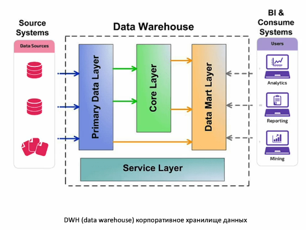
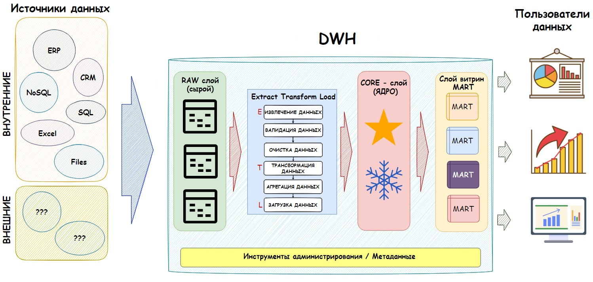
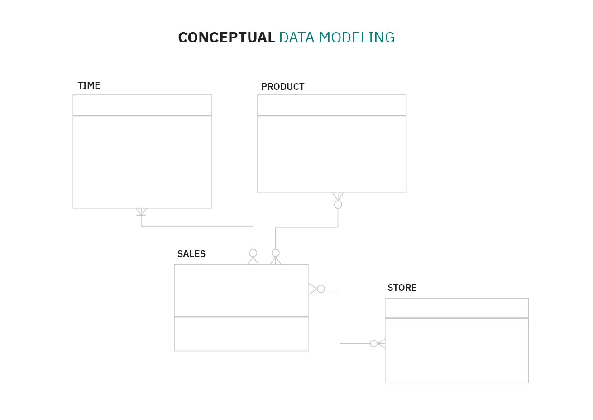
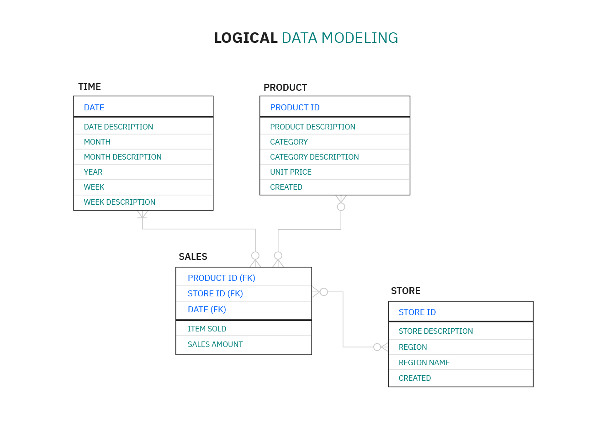
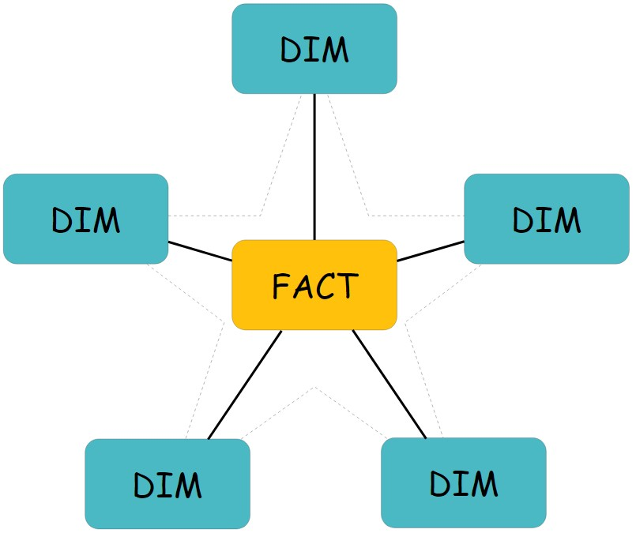
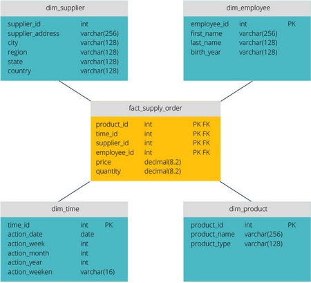
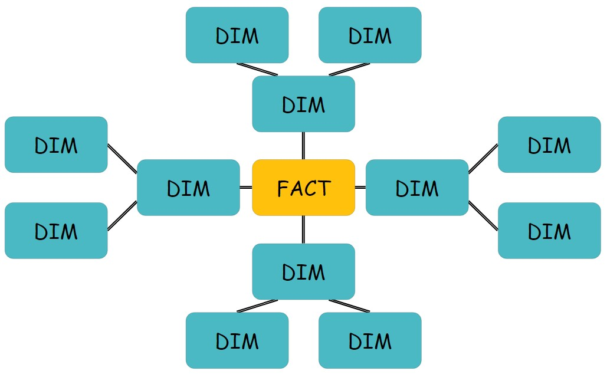
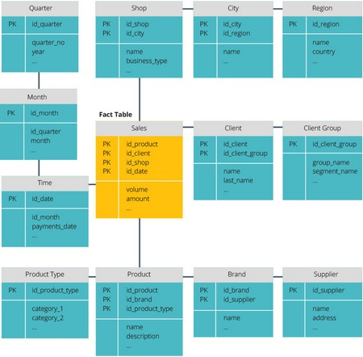
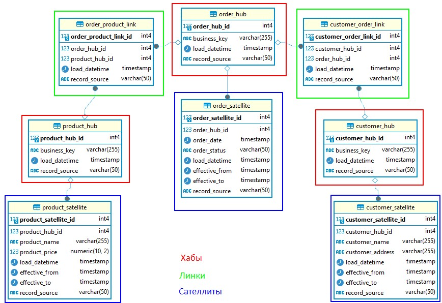

#  Что такое DWH?

DWH (Data Warehouse) - это централизованное хранилище данных, предназначенное для хранения и анализа больших объемов данных из различных источников. DWH служит основой для аналитического процесса и принятия решений в организации.

Теперь попробуем перефразировать. чтобы стало понятнее. Кажется что в любой компании есть DWH, все сталкивались так или иначе с ним и что нового даст эта тема непонятно. Но тут и кроется самое главное заблуждение: это не совсем так. На самом деле, DWH это не просто какое-то огромное количество данных, это огромное количество данных касаемых какого-либо бизнес-процесса. Нужно понимать, что именно желание изучить, проанализировать  изменения во времени, оптимизировать процесс порождает создание DWH, а не наоборот. Data Warehouse — склад всех нужных и важных для принятия решений данных компании.

Возникает логичный вопрос: Зачем держать для этого всего DWH если аналитики вполне могут ходить в базы данных разных систем и просто брать оттуда то, что им надо? Есть основные причины, которые прояснят появление и необходимость в DWH:

+ Если компания большая, на получение данных из разных источников нужно собирать разрешения и доступы. У каждого подразделения в такой ситуации, как правило, свои базы данных со своими паролями, которые надо будет запрашивать отдельно. В DWH все нужное уже будет под рукой в готовом виде. Можно просто пойти и дернуть там необходимую статистику.
+ Данные в DWH не теряются и хранятся в виде, удобном для принятия решений: есть исторические записи, есть агрегированные значения. В операционной базе данных такой информации может и не быть. Например, админы уж точно не будут хранить на складском сервере архив запасов за 10 лет — БД склада в таком случае была бы слишком тяжелой. А вот хранить агрегированные запасы со склада в DWH — это нормально.
+ DWH оптимизируется для работы аналитиков, а эти ребята могут запрашивать очень большие объемы информации. Если они будут делать это с помощью DWH — ничего страшного, даже если их запрос будет обрабатываться очень долго. А если запросить слишком много записей с боевой базы данных сервера — он может уйти в отказ до конца выполнения запроса от аналитики и создать проблемы для других систем. DWH исключает риск того, что аналитики что-то повесят или сломают.

Теперь формализуем наши знания по пунктам, заодно подчеркнем положительные и отрицательные стороны при появлении DWH.

Основные характеристики DWH:

1. Централизованное хранилище данных: DWH объединяет данные из различных операционных источников данных в одно централизованное хранилище. Это позволяет упростить доступ и анализ данных, а также обеспечить единообразие и согласованность данных.

2. Оптимизированная схема данных: Данные в DWH организованы в оптимизированной структуре, обеспечивающей быстрый доступ к данным для аналитических целей. Обычно используются схемы звезды или снежинки, которые оптимизированы для выполнения агрегированных запросов и аналитических операций.

3. Исторические данные: DWH хранит исторические данные, которые могут быть использованы для анализа трендов, прошлых результатов и прогнозирования будущих событий. Благодаря хранению исторических данных, DWH позволяет анализировать долгосрочные паттерны и проводить корреляционный анализ между различными временными периодами.

4. Интеграция данных: DWH интегрирует данные из различных источников, таких как транзакционные базы данных, внешние системы, веб-сервисы, ERP и другие источники данных. Это позволяет анализировать данные из разных источников и создавать комплексные отчеты и аналитические модели.

5. Аналитический инструментарий: DWH предоставляет набор инструментов и возможностей для анализа данных, включая OLAP (Online Analytical Processing), инструменты визуализации данных, аналитические отчеты, машинное обучение и другие методы анализа данных. Это позволяет пользователям проводить сложный анализ данных и получать ценную информацию для принятия решений.

Преимущества DWH:

- Улучшенная производительность запросов: DWH оптимизирован для выполнения агрегированных запросов и аналитических операций, что обеспечивает высокую производительность запросов и быстрый доступ к данным.
- Удобство использования: DWH предоставляет единообразный интерфейс и удобные инструменты для доступа и анализа данных, что упрощает работу аналитиков и пользователей.
- Централизованное хранение данных: DWH предоставляет единое хранилище для всех данных организации, что упрощает управление данными и обеспечивает консистентность данных.
- Улучшенное принятие решений: DWH предоставляет аналитические возможности для проведения сложного анализа данных, что помогает организации принимать информированные решения.

Недостатки DWH:

- Высокие затраты на инфраструктуру: Развертывание и поддержка DWH требует значительных инвестиций в инфраструктуру, аппаратное обеспечение и обслуживание базы данных.
- Ограничения в режиме реального времени: DWH часто ориентирован на пакетную обработку данных и не обеспечивает мгновенного доступа к данным в режиме реального времени.
- Сложность интеграции данных: Интеграция данных из различных источников может быть сложной задачей, требующей дополнительного времени и ресурсов. (Вот тут намек на сложность работы DE - не все данных лежат в красивых табличках)

## Еще раз про разницу между DWH и базами данных

Обычные базы данных и DWH (Data Warehouse) имеют различные цели, структуру и способы использования данных. Вот основные отличия между ними:

1. Цель использования данных: Обычные базы данных обычно предназначены для операционных задач, таких как сохранение и обработка текущих данных, поддержка транзакций и обновлений. DWH, с другой стороны, предназначен для аналитических задач, таких как анализ, отчетность и принятие решений на основе больших объемов данных.

2. Структура данных: В обычных базах данных данные обычно организованы в нормализованных структурах, чтобы избежать дублирования и обеспечить эффективное обновление и поддержку транзакций. В DWH данные часто организованы в денормализованных структурах, таких как схемы звезды или снежинки, чтобы обеспечить быстрый доступ и анализ данных.

3. Временность данных: В обычных базах данных данные обычно представляют текущее состояние системы и часто обновляются. В DWH данные хранятся на долгосрочной основе и содержат исторические данные, которые используются для анализа трендов, прошлых результатов и прогнозирования будущих событий.

4. Объем данных: В обычных базах данных объем данных обычно намного меньше по сравнению с DWH. DWH предназначен для обработки и анализа больших объемов данных из различных источников.

5. Запросы и аналитика: Обычные базы данных обычно оптимизированы для обработки операционных запросов и поддержки транзакций. DWH оптимизирован для выполнения агрегированных запросов, сложных аналитических операций и создания отчетов.

6. Скорость доступа к данным: Обычные базы данных обеспечивают быстрый доступ к текущим данным и обновлениям. DWH обеспечивает быстрый доступ к историческим данным и выполнение сложных аналитических операций.

Обычные базы данных и DWH имеют различные роли и функции в организации. Обычные базы данных предоставляют операционную поддержку и обеспечивают актуальные данные для ежедневных операций, в то время как DWH предоставляет централизованное хранилище данных для аналитических задач и принятия решений на основе данных из различных источников. DWH не заменяет базы - они как были так и есть в компании, DWH забирает из них нужное в себя для создания основы принятия решения.

Этот шаг еще раз показывает особенную роль DWH, некоторые различия мы уже упоминали ранее. Но в данном шаге они повторяются именно с учетом контекста различий. Может показаться, что некоторая информация избыточна - просто хочется предостеречь вас от ошибок восприятия, когда кажется, что тема легкая и изначально понятная, а на самом деле это не так. Вспоминая свой стартовый опыт, могу сказать что с восприятием DWH у меня было именно так. Надеюсь дополнителная информация и иллюстрации помогут вам избежать этого. 

##  Из чего состоит DWH?

**DWH (Data Warehouse)** обычно включают в себя следующие основные компоненты:

1. ETL (Extract, Transform, Load): ETL является ключевым компонентом DWH и отвечает за извлечение данных из различных источников, их трансформацию и загрузку в хранилище данных. ETL процесс обеспечивает очистку, преобразование и интеграцию данных, чтобы они соответствовали требованиям DWH.

2. Хранилище данных: Хранилище данных представляет собой централизованное место для хранения и управления данными в DWH. Обычно используется реляционная база данных, специально оптимизированная для аналитических операций и запросов.

3. Моделирование данных: Моделирование данных включает определение структуры данных в DWH, таких как схемы звезды или снежинки (об этом далее). Моделирование данных облегчает аналитический процесс и обеспечивает эффективность выполнения запросов.

4. Аналитический инструментарий: Аналитический инструментарий включает набор инструментов и технологий для анализа данных в DWH. Это может включать OLAP (Online Analytical Processing) инструменты, инструменты визуализации данных, инструменты машинного обучения и другие.

5. Метаданные: Метаданные представляют собой описание и характеристики данных в DWH. Они содержат информацию о структуре данных, источниках, связях между таблицами и другие метаданные, необходимые для понимания и использования данных в DWH.

6. Инструменты администрирования: Инструменты администрирования обеспечивают управление и мониторинг DWH, включая задачи управления пользователями, безопасностью, мониторинг производительности, резервное копирование и восстановление данных и другие административные функции.

Упрощенно это можно представить так:

Необходимо разъяснить данную схему:

Итак мы имеем множество источников данных - как внутренних (всевозможные способы хранения данных, таблички Excel, базы 1С, всевозможные системы учета и т. д.), так и внешних (множество справочников, публичных источников данных, всевозможные вспомогательные сервисы и сайты и прочее). 

Задача состоит в том, чтобы из всего этого доступного множества выбрать информацию, которая поможет ответить аналитику на вопрос руководства типа " как увеличить прибыль?" или "что нужно изменить для увеличения количества клиентов?" - то есть вопрос конкретно касающийся бизнес-интересов и бизнес-показателей компании.\
Чтобы ответить на такого рода вопросы, аналитикам необходимы данные.Именно та выборка данных которая поможет поиску ответа или так или иначе связана с ответом на вопрос и должна будет попасть в DWH.

Теперь, когда с набором данных определились, мы видим что не все они "красивые" и готовые к работе - тут начинается "выковыривание" нужных данных и загрузка в так называемый "сырой" слой. \
Там они худо бедно раскладываются в множество  некого подобия таблиц - почему подобия, да потому что в этих таблицах будут и пропуски, и повторения, и "крокозябры" из-за различных проблем с кодировками, несовместимостью форматов и прочих неочевидных на первый взгляд вещей. \
Но радуемся мы все же потому, что они есть и они уже определены - поверьте это тоже нелегко, выявить все причастные к бизнес-процессу данные.

После этого наступает процесс моделирования CORE-слоя DWH. CORE-слой - это ядро хранилища. Неслучайно там изображены "звезда" и "снежинка" - это модели хранения данных, о которых вы узнаете в следующих главах. В двух словах это порядок, который позволит из хаоса RAW-слоя получить уже ценные для аналитика данные. Но между RAW и CORE слоем есть процесс, который называется ETL ("Extract, Transform, Load" - Извлечение, Преобразование, Загрузка) - это процесс, который используется для интеграции данных из различных источников в хранилище данных. \
Это также  включает очистку данных от ошибок и дубликатов, стандартизацию форматов, преобразование типов данных, агрегацию и другие манипуляции, чтобы данные стали удобными для анализа и хранения. Так данные становятся "красивыми" и уже подходят для формирования витрин (MART - витрина). \
Витрины данных играют ключевую роль в аналитике и управлении данными, обеспечивая доступ к сущностям и метрикам, которые важны для бизнеса, в оптимизированной форме. По-простому витрины это небольшие аналитические таблички, по которым строят свои графики и диаграммы аналитики. В них все агрегировано и компактно. Данные в витрине обычно представлены в оптимизированной для анализа форме. И витрин как вы понимаете может быть великое множество - все зависит от фантазии аналитиков и абсурдности выстроенных ими гипотез). \
Ну и понятно, что построенные графики и используются в дашбордах (Dashboard - информационная панель ) - инструментах визуализации данных, предназначенный для отображения ключевых метрик, показателей и информации в удобной и понятной форме, которые и показывают руководителям для объяснения тех или иных явлений в бизнесе и сопутствующих процессах.

### Процесс моделирования данных

Моделирование данных начинается с договоренности о том, какие символы используются для представления данных, как размещаются модели и как передаются бизнес-требования. Это формализованный рабочий процесс, включающий ряд задач, которые должны выполняться итеративно. Сам процесс обычно выглядят так:

1. Определите сущности. На этом этапе идентифицируем объекты, события или концепции, представленные в наборе данных, который необходимо смоделировать. Каждая сущность должна быть целостной и логически отделенной от всех остальных.

2. Определите ключевые свойства каждой сущности. Каждый тип сущности можно отличить от всех остальных, поскольку он имеет одно или несколько уникальных свойств, называемых атрибутами. Например, сущность «клиент» может обладать такими атрибутами, как имя, фамилия, номер телефона и т.д. Сущность «адрес» может включать название и номер улицы, город, страну и почтовый индекс.

3. Определите связи между сущностями. Самый ранний черновик модели данных будет определять характер отношений, которые каждая сущность имеет с другими. В приведенном выше примере каждый клиент «живет по» адресу. Если бы эта модель была расширена за счет включения сущности «заказы», ​​каждый заказ также был бы отправлен на адрес. Эти отношения обычно документируются с помощью унифицированного языка моделирования (UML).

4. Полностью сопоставьте атрибуты с сущностями. Это гарантирует, что модель отражает то, как бизнес будет использовать данные. Широко используются несколько формальных шаблонов (паттернов) моделирования данных. Объектно-ориентированные разработчики часто применяют шаблоны для анализа или шаблоны проектирования, в то время как заинтересованные стороны из других областей бизнеса могут обратиться к другим паттернам.

5. Назначьте ключи по мере необходимости и определите степень нормализации. Нормализация — это метод организации моделей данных, в которых числовые идентификаторы (ключи) назначаются группам данных для установления связей между ними без повторения данных. Например, если каждому клиенту назначен ключ, этот ключ можно связать как с его адресом, так и с историей заказов, без необходимости повторять эту информацию в таблице с именами клиентов. Нормализация помогает уменьшить объем дискового пространства, необходимого для базы данных, но может сказываться на производительности запросов.

6. Завершите и проверьте модель данных. Моделирование данных — это итеративный процесс, который следует повторять и совершенствовать под потребности бизнеса.

## Концептуальный, логический и физический уровень моделирования

Разработка баз данных и информационных систем начинается с высокого уровня абстракции и с каждым шагом становится все точнее и конкретнее. В зависимости от степени абстракции модели данных можно разделить на три категории. Процесс начинается с концептуальной модели, переходит к логической модели и завершается физической моделью. 

+ Концептуальные модели данных. Также они называются моделями предметной области и описывают общую картину: что будет содержать система, как она будет организована и какие бизнес-правила будут задействованы. \
    Концептуальные модели обычно создаются в процессе сбора исходных требований к проекту. Как правило, они включают классы сущностей (вещи, которые бизнесу важно представить в модели данных), их характеристики и ограничения, отношения между сущностями, требования к безопасности и целостности данных. Любые обозначения обычно просты.

+ Логические модели данных уже не так абстрактны и предоставляют более подробную информацию о концепциях и взаимосвязях в рассматриваемой области. Они содержат атрибуты данных и показывают отношения между сущностями. \
  Логические модели данных не определяют никаких технических требований к системе. Логические модели данных могут быть полезны для проектов, ориентированных на данные по своей природе. Например, для проектирования хранилища данных или разработки системы отчетности.

  

+ Физические модели данных представляют схему того, как данные будут храниться в базе. По сути, это наименее абстрактные из всех моделей. Они предлагают окончательный дизайн, который может быть реализован как реляционная база данных, включающая ассоциативные таблицы, которые иллюстрируют отношения между сущностями, а также первичные и внешние ключи для связи данных.

## Известные модели данных: звезда и снежинка

Схемы «звезда» и «снежинка» — это два способа структурировать хранилище данных.

Схема типа «звезда» имеет централизованное хранилище данных, которое хранится в таблице фактов. Схема разбивает таблицу фактов на ряд денормализованных таблиц измерений. Таблица фактов FACT содержит данные, которые будут использоваться для составления отчетов, а таблица измерений DIM (от англ. Dimension - измерение) описывает хранимые данные.

Денормализованные проекты менее сложны, потому что данные сгруппированы. Таблица фактов использует только одну ссылку для присоединения к каждой таблице измерений. Более простая конструкция звездообразной схемы значительно упрощает написание сложных запросов.

Для примера:

В нашем примере центральная таблица (фактическая таблица) как раз и содержит в себе значения фактов (поставка заказа), а 4 таблицы вокруг (измерительные таблицы) - содержат в себе измерения (dimension): поставщика(supplier), сотрудника(employee), времени (time) и товара (product).  Обратите внимание, что таблица фактов содержит в основном только идентификаторы - ссылки на измерительные таблицы.

 

**Схема типа «снежинка»** отличается тем, что использует нормализованные данные. Нормализация означает эффективную организацию данных так, чтобы все зависимости данных были определены, и каждая таблица содержала минимум избыточности. Таким образом, отдельные таблицы измерений разветвляются на отдельные дополнительные таблицы измерений.

Схема «снежинки» использует меньше дискового пространства и лучше сохраняет целостность данных. Основным недостатком является сложность запросов, необходимых для доступа к данным — каждый запрос должен пройти несколько соединений таблиц, чтобы получить соответствующие данные.Ну просто представьте сколько JOINов надо выполнить для получения "человекочитаемой" строки.

В этом примере фактическая таблица - это продажи (Sales). Все остальные таблицы - измерительные.

Таблица Sales соединяет все измерительные таблицы через внешние ключи (FK):
+ id_product с Product.
+ id_client с Client.
+ id_shop с Shop.
+ id_date с Time.

Таблицы измерений нормализованы:
+ Product соединена с Product Type и Brand.
+ Client соединена с Client Group.
+ Shop соединена с City, а City с Region.
+ Brand соединена с Supplier.
+ Time соединена с Month, а Month с Quarter.

**Модели "звезда" (star schema) и "снежинка" (snowflake schema)** являются двумя распространенными подходами к проектированию хранилищ данных. Рассмотрим их основные отличия:

1. Структура данных:
  + Звезда: Основана на одной фактической таблице, связанной с несколькими измерениями. Измерения могут содержать подуровни, но они хранятся в рамках одной таблицы.
  + Снежинка: Имеет структуру, где измерения содержат подуровни, которые могут быть разделены на отдельные таблицы.

2. Нормализация:
  + Звезда: Частично денормализованная модель, что означает, что данные хранятся в виде таблиц с минимальной нормализацией для ускорения запросов.
  + Снежинка: Более нормализованная модель, где таблицы данных более раздроблены для более эффективного использования хранилища.

3. Производительность запросов:
 + Звезда: Запросы обычно выполняются быстро благодаря денормализации, что уменьшает количество соединений таблиц.
 + Снежинка: Может быть менее эффективной для некоторых запросов из-за необходимости большего числа соединений таблиц.

4. Управление данными:
+ Звезда: Проще в обновлении данных, так как они хранятся в относительно плоской структуре.
+ Снежинка: Обновление данных может быть более сложным из-за большего количества таблиц и соединений.

5. Гибкость:
+ Звезда: Легче в использовании и понимании, что делает ее предпочтительной для многих случаев.
+ Снежинка: Более сложная структура может быть полезной для более сложных иерархий данных и связей.

## DataVault

Есть еще один скрупулезный подход к организации хранения данных в DWH. Он называется Data Vault и требует большего уровня квалификации для проектирования и поддержки.

Data Vault - это методология проектирования хранилищ данных, которая обеспечивает гибкость, масштабируемость и отслеживаемость изменений в данных. Она была разработана Дэном Линстедом (Dan Linstedt) и ориентирована на создание гибких и устойчивых хранилищ данных для аналитических целей. Основные принципы Data Vault включают:

1. Модульность: Хранилище данных строится из набора модулей (hubs, links, satellites), каждый из которых отвечает за определенный аспект данных и может быть легко модифицирован или расширен без влияния на другие части хранилища.

2. Историчность: Data Vault сохраняет всю историю изменений данных, что позволяет аналитикам проводить анализ изменений во времени и понимать эволюцию данных.

3. Гибкость: Модель Data Vault легко адаптируется к изменениям в структуре и источниках данных, что делает ее более гибкой и устойчивой к изменениям в бизнес-требованиях.

4. Отслеживаемость: Data Vault обеспечивает четкое отслеживание источников данных и связей между ними, что облегчает понимание происхождения и структуры данных.

Data Vault состоит из трех основных элементов: хабов (hubs), связей (links) и спутников (satellites).

1. Хабы (Hubs): Хабы представляют собой уникальные списки ключей для каждой сущности данных. Они являются центральными элементами модели и служат для централизованного хранения ключевых атрибутов сущности.

2. Связи (Links): Связи представляют собой ассоциативные таблицы, которые устанавливают связь между хабами. Они позволяют моделировать связи между различными сущностями данных.

3. Спутники (Satellites): Спутники содержат атрибуты, которые описывают контекст или детали данных из хабов или связей. Они могут содержать дополнительные атрибуты сущности, исторические данные или метаданные.

Эти элементы совместно образуют гибкую и масштабируемую модель данных, которая позволяет эффективно хранить, управлять и анализировать большие объемы данных.

Давайте поподробнее рассмотрим Data Vault на примере. Это важно, так как позволит выстроить правильную парадигму мышления в отношении как структуры DWH в целом, так и организации связей между данными с точки зрения бизнес-ценности в частности.

Рассмотрим пример интернет-магазина, который хочет создать хранилище данных для анализа поведения клиентов. В названиях таблиц для наглядности укажем их принадлежность.

Еще раз уточним насчет содержания: хабы содержат ключевые бизнес-сущности, связи объединяют их, а сателлиты добавляют описательные и исторические данные. Этот подход обеспечивает гибкость, масштабируемость и возможность отслеживания изменений во времени.

Посмотрим на схему получившегося Data Vault:

 + Хабы:\
    Хабы содержат бизнес-ключи и являются основными таблицами для идентификации сущностей. Например, order_hub идентифицирует заказы, product_hub идентифицирует продукты, а customer_hub идентифицирует клиентов.

  + Линки:\
    Линки соединяют хабы между собой и представляют отношения между ними. Например, order_product_link соединяет заказы и продукты, а customer_order_link соединяет клиентов и заказы.

  + Сателлиты:\
    Сателлиты содержат описательные атрибуты и дополнительную информацию, связанную с хабами и линками. Например, order_satellite содержит данные о датах и статусах заказов, product_satellite содержит информацию о продуктах, а customer_satellite содержит информацию о клиентах.

 

Подведем небольшие итоги:  В очередной раз нельзя однозначно ответить на вопрос какая модель лучше. Выбор зависит от конкретных требований и контекста (опять всплывает основная сложность в работе DE - выбор оптимального инструмента):

  > Если нужна простота и высокая производительность для отчетов и анализа, выбирайте модель **"Звезда"**.\
  > Если требуется баланс между нормализацией и производительностью, рассмотрите модель **"Снежинка"**.\
  > Если важна гибкость, масштабируемость и управление историчностью данных, **Data Vault** будет лучшим выбором.

Введение в Data Vault: \
  https://habr.com/ru/articles/348188/

