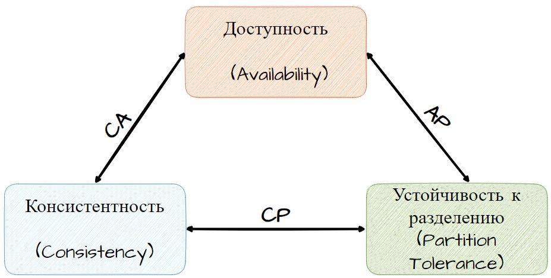

# Что такое NoSQL хранилища данных?

Начнем с того, что реляционные базы данных (SQL) долгое время были основным инструментом для хранения данных. Они хорошо справлялись с задачами, где данные организованы в таблицы с четкой структурой, например, в бухгалтерии, управлении запасами, и прочих бизнес-приложениях. Структура SQL баз данных обеспечивает:

+ Целостность данных: строгие правила помогают избежать ошибок и дублирования данных.
+ Возможность сложных запросов: с помощью языка SQL можно получать сложные выборки данных из нескольких таблиц.

Со временем стало ясно, что у реляционных баз данных есть некоторые ограничения, особенно в условиях стремительного роста объемов данных и увеличения разнообразия типов данных. Вот несколько основных проблем:

+ Масштабируемость: Традиционные SQL базы данных не всегда хорошо справляются с горизонтальным масштабированием (увеличением числа серверов).
+ Гибкость схемы: В реляционных базах данных структура таблиц жестко определена, что усложняет работу с данными, структура которых часто меняется.
+ Производительность: При работе с очень большими объемами данных, запросы могут становиться медленными.

С появлением новых технологий и ростом популярности веб-приложений, социальных сетей и мобильных приложений возникли новые требования к базам данных:

+ Большие данные: Необходимость обрабатывать и хранить огромные объемы данных.
+ Разнообразие данных: Различные типы данных (тексты, изображения, видео, JSON документы и т.д.).
+ Гибкость: Быстрая адаптация под изменяющиеся потребности бизнеса.

Здесь на сцену выходят NoSQL базы данных, которые были разработаны для удовлетворения этих новых требований. NoSQL (от англ. not only SQL — «не только SQL») — обозначение широкого класса разнородных систем управления базами данных, появившихся в конце 2000-х — начале 2010-х годов и существенно отличающихся от традиционных реляционных СУБД. Уже само название заявляет, что управлять данными можно не только с помощью Structured Query Language (SQL), т. е. языка структурированных запросов.

NoSQL предлагает несколько важных преимуществ - в противовес недостаткам реляционных баз данных:

+ Масштабируемость: Легко масштабируются горизонтально, распределяя данные по множеству серверов.
+ Гибкость схемы: Нет жесткой структуры, что позволяет хранить разнородные данные и изменять структуру данных на лету.
+ Высокая производительность: Оптимизированы для обработки больших объемов данных и высоких нагрузок.

Основные типы NoSQL баз данных и их применение:

1. Документные базы данных (например, MongoDB): Хранят данные в виде документов (JSON), что удобно для работы с неструктурированными данными.
2. Графовые базы данных (например, Neo4j): Используются для работы с сильно связанными данными, такими как социальные графы.
3. Ключ-значение хранилища (например, Redis): Простой и быстрый способ хранения пар ключ-значение.
4. Колоночные базы данных (например, Cassandra ): Хорошо подходят для аналитики и работы с большими объемами данных.

> Появление NoSQL баз данных стало ответом на изменившиеся требования к обработке и хранению данных в современных приложениях. Это позволило компаниям более эффективно управлять своими данными и адаптироваться к быстро меняющимся условиям бизнеса.

Попробуем "четко" определить NoSQL базы данных следующим образом: базы данных, которые жертвуют атомарностью и согласованностью ради масштабируемости и доступности

Как мы выяснили ранее с развитием интернета и ростом количества пользователей, объем данных, с которыми приходится работать, значительно увеличился. Стало очевидно, что для эффективной обработки этих данных необходимо еще и распределять их по множеству серверов, находящихся в разных географических зонах.

А с увеличением числа узлов в распределенной системе обеспечивать согласованность данных становится все сложнее. Когда данные реплицируются на нескольких узлах, необходимо, чтобы изменения в данных были синхронизированы, что может вызвать задержки и конфликты.

Вместе с тем, как возросшие объемы данных повышают требования к хранению, и современные приложения требуют высокой доступности и надежности. Пользователи ожидают, что сервисы будут работать 24/7 без простоев. Для этого системы должны быть устойчивыми к сбоям, что подразумевает возможность продолжать работу даже при отказе отдельных компонентов или при нарушениях в сетевом соединении.

### CAP теорема

Именно эти вызовы и привели к **формулировке теоремы CAP.**

В 2000 году Эрик Брюер (Eric Brewer), профессор компьютерных наук в Калифорнийском университете в Беркли, на конференции PODC (Principles of Distributed Computing) представил свои идеи о том, что распределенная система не может одновременно обеспечивать все три свойства — согласованность, доступность и устойчивость к разделению. Позднее эти идеи были формализованы как теорема CAP.

Теорема CAP утверждает, что в любой распределенной системе возможно обеспечить только два из трех свойств одновременно:

1. Согласованность (Consistency): Все узлы в системе имеют одинаковые данные в любой момент времени.
2. Доступность (Availability): Каждый запрос к системе получает ответ (не обязательно успешный) в течение разумного времени.
3. Устойчивость к разделению (Partition Tolerance): Система продолжает функционировать, несмотря на разделение сети, которое может приводить к тому, что сообщения между узлами теряются или задерживаются.

Как это относится к NoSQL и к нашей теме? Очень просто - согласно теореме, система может гарантировать только два из этих свойств одновременно. Это важно для понимания выбора архитектуры NoSQL баз данных, поскольку разные базы данных оптимизируют разные комбинации этих свойств. 

В дальнейшем мы обязательно рассмотрим, как это связано с различными примерами баз данных и даже укажем какие "компромиссы CAP" используются в основе той или иной NoSQL СУБД.

## Основные дистрибутивы NoSQL баз данных

1. MongoDB (CP)

Одна из самых популярных NoSQL баз данных, использующая JSON-подобные документы для хранения данных.

+ Преимущества: MongoDB хорошо масштабируется и поддерживает горизонтальное масштабирование.
+ Пример использования: eBay использует MongoDB для управления несколькими аспектами своего бизнеса, включая обработку данных о пользователях и транзакциях.
+ Масштаб: Благодаря гибкости и возможности горизонтального масштабирования, MongoDB помогает eBay эффективно обрабатывать большие объемы данных, обеспечивая высокую производительность и доступность
+ Согласованность и устойчивость к разделению: MongoDB предпочитает быть согласованной и устойчивой к разделению, жертвуя доступностью - при возникновении сетевых проблем, она может временно приостановить возможность записи до восстановления соединения, чтобы сохранить согласованность данных.
+ Применение: Подходит для приложений, где важно, чтобы данные были актуальными и доступными, например, в e-commerce или социальных сетях.

2. Cassandra (AP)

 Распределенная база данных, спроектированная для обработки больших объемов данных на нескольких серверах без единой точки отказа.

+ Преимущества: Обеспечивает высокую доступность и отказоустойчивость, основана на модели данных ключ-значение.
    > Пример использования: Netflix использует Apache Cassandra для хранения и управления метаданными своего видеоконтента.
+ Масштаб и ценность: Cassandra обеспечивает высокую доступность и устойчивость к отказам, что критически важно для Netflix, учитывая огромный объем данных и необходимость бесперебойного предоставления сервиса пользователям по всему миру.
+ Доступность и устойчивость к разделению: Cassandra оптимизирована для обеспечения доступности и устойчивости к разделению, жертвуя строгой согласованностью. При чтении данных возможны незначительные несоответствия, которые будут исправлены со временем (eventual consistency).
+ Применение: Подходит для приложений, требующих высокой доступности и масштабируемости, таких как системы мониторинга и интернет-сервисы.

3. Redis(CP)

Отличается высокой производительностью и используется для кэширования данных в памяти, хранения сеансов пользователей, реализации очередей сообщений и других задач, где требуется быстрый доступ к данным.

+ Преимущества: Очень быстрая и эффективная работа с данными благодаря хранению в оперативной памяти.
> Пример использования: Twitter использует Redis для кэширования данных и управления очередями сообщений.
+ Масштаб и ценность: Высокая производительность Redis позволяет Twitter быстро обрабатывать миллионы запросов в секунду, обеспечивая своевременную доставку данных пользователям.
+ Согласованность и устойчивость к разделению: Redis, особенно в кластерах с репликацией, может быть настроен на обеспечение согласованности и устойчивости к разделению, жертвуя доступностью в случае разделения сети.
+ Применение: Часто используется для кэширования данных и управления сессиями, где важна высокая производительность и согласованность данных.

4. Apache HBase (CP)

Распределенная, масштабируемая база данных, работающая поверх Hadoop Distributed File System (HDFS).

+ Преимущества: Предоставляет возможности для хранения и обработки больших объемов данных.
> Пример использования: Facebook использует HBase для хранения сообщений и другой социальной активности пользователей.
+ Масштаб и ценность: HBase, работающая поверх HDFS, обеспечивает масштабируемость и надежность, необходимые для управления огромными объемами данных, генерируемыми миллиардами пользователей.
+ Согласованность и устойчивость к разделению: HBase предпочитает согласованность и устойчивость к разделению. Это значит, что при разделении сети, система может стать недоступной до восстановления соединения.
> Применение: Идеально подходит для аналитических задач и работы с большими данными в распределенных системах, таких как социальные сети и поисковые системы.

5. Couchbase(CA)

Поддерживает модель данных ключ-значение и документов.

+ Преимущества: Обладает высокой производительностью и масштабируемостью.
> Пример использования: LinkedIn использует Couchbase для реализации системы рекомендаций.
+ Масштаб и ценность: Высокая производительность и масштабируемость Couchbase позволяют LinkedIn обрабатывать данные о пользователях и их поведении в реальном времени, предоставляя актуальные и персонализированные рекомендации.
+ Согласованность и доступность: Couchbase обеспечивает согласованность и доступность, жертвуя устойчивостью к разделению. В случае сетевых проблем данные могут быть временно недоступны.
+ Применение: Подходит для высоконагруженных приложений, требующих быстрых и согласованных данных, таких как мобильные приложения и веб-приложения.

6. Amazon DynamoDB (AP)

Управляемая NoSQL база данных, предоставляемая Amazon Web Services (AWS).

+ Преимущества: Обеспечивает быстрый и предсказуемый доступ к данным при любом масштабе.
> Пример использования: Lyft использует Amazon DynamoDB для управления профилями пользователей и данными о поездках.
+ Масштаб и ценность: Управляемая и масштабируемая архитектура DynamoDB позволяет Lyft эффективно обрабатывать данные в реальном времени, обеспечивая надежность и производительность приложения даже при высоких нагрузках.
+ Доступность и устойчивость к разделению: DynamoDB обеспечивает доступность и устойчивость к разделению, при этом может работать с eventual consistency для некоторых операций.
+ Применение: Используется в приложениях, требующих высокой масштабируемости и доступности, таких как интернет-магазины и IoT-приложения.

 
Каждый из этих дистрибутивов NoSQL баз данных имеет свои сильные стороны и лучше всего подходит для определенных типов задач и данных. 

> Выбор конкретного дистрибутива зависит от ваших требований к объему данных, структуре данных, необходимости в масштабируемости и производительности.\
> А так же от приоритетов вашего приложения: необходимость высокой доступности, строгой согласованности или устойчивости к разделению сети.

Помните архитектуру ACID - для SQL? Очевидно, ей нет места среди NoSQL решений. Здесь главенствует BASE - в следующем шаге немного о ней.
